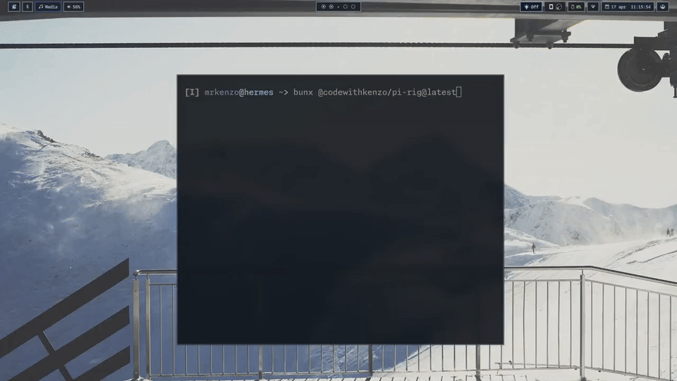

# Pi Rig

[](https://www.npmjs.com/package/@codewithkenzo/pi-rig)
[](https://www.npmjs.com/package/@codewithkenzo/pi-dispatch)
[](https://www.npmjs.com/package/@codewithkenzo/pi-theme-switcher)
[](https://bun.sh)
[](https://effect.website)
[](https://www.typescriptlang.org)

A suite of extensions for the Pi coding agent.

Pi Rig handles the execution, messaging, routing, and workflow state layers that matter most during long agent runs: queued work, remote updates, scheduled delivery, and consistent runtime context.

Pi Rig is built on [pi-mono](https://github.com/badlogic/pi-mono), the open-source Pi coding agent by Mario Zechner, and targets the Pi extension ecosystem around `@mariozechner/pi-agent-core`.

## Quick demos

### Pi Dispatch
[](./docs/media/demos/pi-dispatch-demo.mp4)

Queue-aware profile runs, background jobs, and the flow deck in one short clip.

### Theme Switcher
[](./docs/media/demos/theme-switcher-demo.mp4)

Live theme preview, set, and cycle flow inside a real Pi session.

### Pi Rig installer
[](./docs/media/demos/pi-rig-installer-demo.mp4)

The installer path for getting the published extensions onto a fresh Pi setup.

## Extensions

| Extension | Package | Status | Surfaces | Notes |
|---|---|---|---|---|
| [Pi Dispatch](https://github.com/codewithkenzo/pi-dispatch) | [`@codewithkenzo/pi-dispatch`](https://www.npmjs.com/package/@codewithkenzo/pi-dispatch) | **Published** | `flow_run`, `flow_batch`, `/flow` | Core execution and queue lane |
| [Theme Switcher](https://github.com/codewithkenzo/pi-theme-switcher) | [`@codewithkenzo/pi-theme-switcher`](https://www.npmjs.com/package/@codewithkenzo/pi-theme-switcher) | **Published** | `theme_set`, `theme_list`, `theme_preview`, `/theme` | Runtime theming and session restore |
| Gateway Messaging | `@codewithkenzo/pi-gateway-messaging` | Source preview | `gateway_turn_preview`, `/gateway` | Remote turn updates + action routing |
| Notify Cron | `@codewithkenzo/pi-notify-cron` | Source preview | `notify_cron_*`, `/notify-cron` | Scheduled delivery and lease-aware ticks |

## Planned roadmap
### Planned plugin map

| Plugin | Status | Primary goal | Notes |
|---|---|---|---|
| `fs-sandbox` | Planned | Execution isolation + policy boundaries | sandbox adapter target for Pi Dispatch |
| `pi-memory` | Planned | Short/long/last-active memory lanes | selective injection, markdown-first storage |
| `pi-board` | Planned | Mission/task coordination surface | planned to absorb interactive plan-mode workflow |
| `pi-voice` | Planned | Voice ingress + transcript workflows | pairs with gateway/remote flows |
| `pi-diff` | Planned | Structured change/delta workflows | token-efficient review lane |
| `pi-rollback` | Planned | Safe rollback/recovery workflows | revert/undo safety for risky operations |

### Phase map

| Phase | Scope | What ships |
|---|---|---|
| Phase 1 (now) | Public release baseline | Dispatch + Theme Switcher + installer path |
| Phase 2 (next) | Source preview hardening | Gateway Messaging + Notify Cron packaging hardening |
| Phase 3 (after) | New extension wave | board/memory/sandbox/diff/voice/rollback lanes |

### Pi Dispatch direction

- interactive **plan mode** (`/plan`, gated execute flow) as the bridge into board workflows
- deeper **VFS/preload** ergonomics and token-safe context injection
- **sandbox adapter integration** for safer execution boundaries

## Install

> Requires [Pi coding agent](https://github.com/badlogic/pi-mono) on your PATH.

### Pick one extension

```bash
pi install npm:@codewithkenzo/pi-dispatch
```

```bash
pi install npm:@codewithkenzo/pi-theme-switcher
```

### Install everything

With Bun:

```bash
bunx @codewithkenzo/pi-rig@latest
```

With npm:

```bash
npx @codewithkenzo/pi-rig@latest
```

### From source

```bash
git clone https://github.com/codewithkenzo/pi-rig.git
cd pi-rig
bun run setup
```

<details>
<summary>Source-only extensions (not yet published)</summary>

```bash
pi install ./extensions/gateway-messaging
pi install ./extensions/notify-cron
```

</details>

### Verify

Open a fresh Pi session and run:

```
/flow profiles
/theme list
```

### Agent prompt (copy/paste)

````md
Install Pi Rig extensions.

- `pi install npm:@codewithkenzo/pi-dispatch`
- `pi install npm:@codewithkenzo/pi-theme-switcher`
- Restart Pi if needed.
- Verify: `/flow profiles` and `/theme list`
- Report what was installed.
````

## Development

```bash
bun run typecheck     # typecheck all packages
bun run test          # run all tests
bun run build         # build all packages
```

Each extension is a self-contained Bun workspace package under `extensions/`.

## Documentation

- [Install guide](./docs/INSTALL.md)
- [Usage guide](./docs/USAGE.md)
- [Telegram pairing guide](./docs/TELEGRAM_PAIRING.md)
- [Documentation index](./docs/README.md)
- [Preview asset guide](./docs/PREVIEWS.md)
- [Public go-live checklist](./docs/PUBLIC_GO_LIVE_CHECKLIST.md)

## Contributing

Good contributions are concrete and scoped:

- reproducible bugs with a minimal reproduction case
- contract and schema fixes
- transport reliability improvements
- packaging and install improvements
- focused behavior changes with clear acceptance criteria
- tests that cover failure-prone paths
