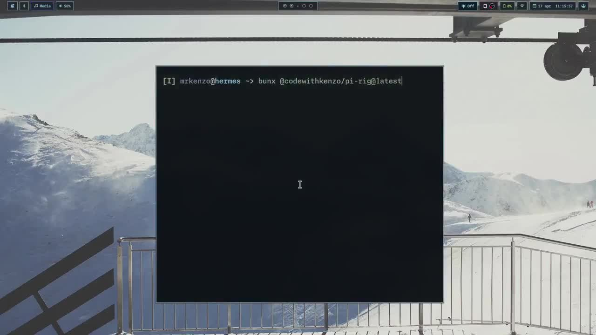

# @codewithkenzo/pi-rig

Interactive installer for all published Pi Rig extensions.

## Quick demo

[](../../docs/media/demos/pi-rig-installer-demo.mp4)

Shows the interactive install path for the published Pi Rig packages.

## Install everything

With Bun:

```bash
bunx @codewithkenzo/pi-rig@latest
```

With npm:

```bash
npx @codewithkenzo/pi-rig@latest
```

## Install one extension

For a single extension, `pi install` is faster:

```bash
pi install npm:@codewithkenzo/pi-dispatch
```

```bash
pi install npm:@codewithkenzo/pi-theme-switcher
```

## Options

| Flag | Effect |
|------|--------|
| `--all` | Skip selector, install everything |
| `--extensions dispatch` | Install specific plugins |
| `--dry-run` | Preview without executing |
| `--pi-path /path/to/pi` | Custom pi binary location |
| `--no-skills` | Skip skill bundle install |
| `--skip-install` | Skip dependency install step |

## Non-interactive mode

When stdin is not a TTY (agents, CI, piped input), all available extensions are installed automatically without prompting.

## Current scope

- [`@codewithkenzo/pi-dispatch`](https://www.npmjs.com/package/@codewithkenzo/pi-dispatch) — task dispatch and queue
- [`@codewithkenzo/pi-theme-switcher`](https://www.npmjs.com/package/@codewithkenzo/pi-theme-switcher) — runtime theme switching

More plugins planned for later phases.
